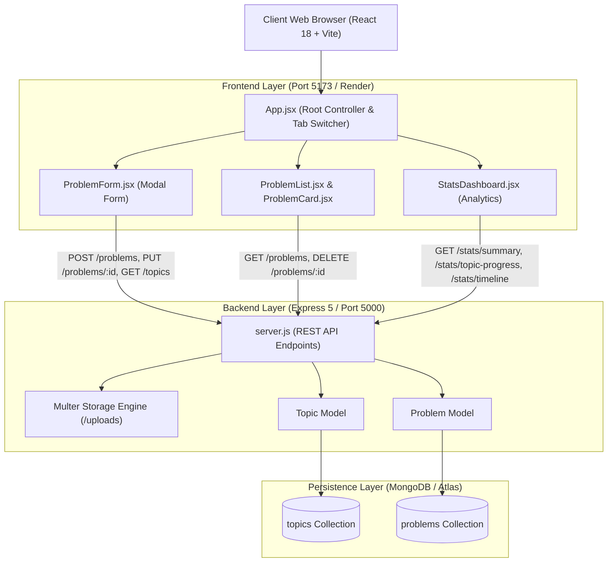
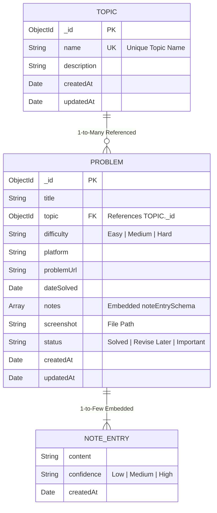
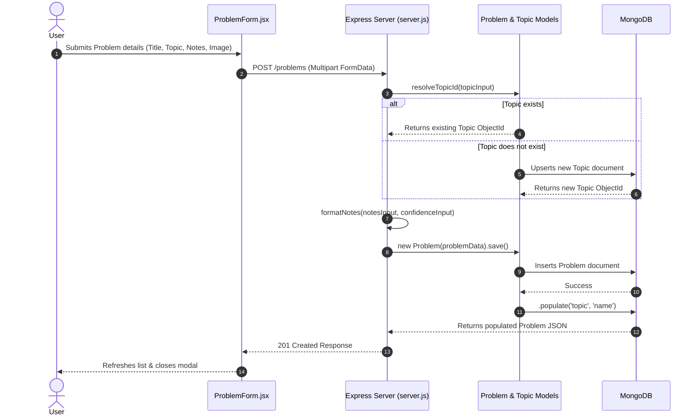
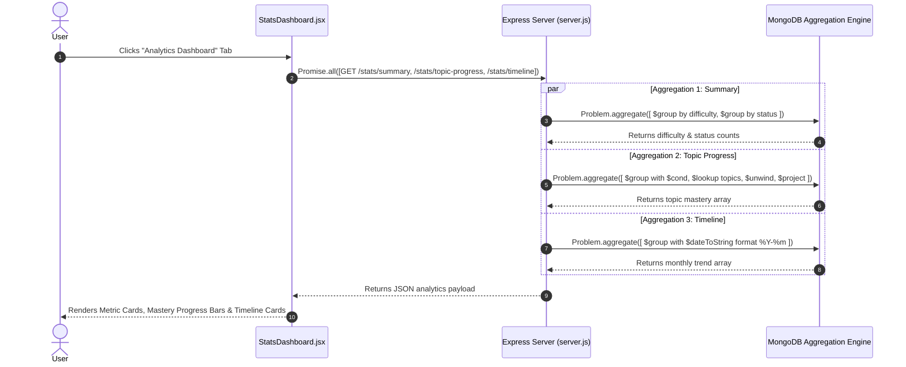

# High-Level Design (HLD) — DSA Problem Tracker

## 1. System Architecture Diagram

---

## 2. Technology Stack & Layer Responsibilities

| Layer | Technology | Primary Responsibilities |
|---|---|---|
| **Presentation (Frontend)** | React 18 (Vite), Lucide Icons, Vanilla CSS | Single Page Application (SPA), state management, tab routing, interactive modal forms, progress bar rendering, metric card visualization. |
| **HTTP Client** | Axios | Asynchronous REST API requests, multipart/form-data payload transmission for screenshots. |
| **Application (Backend)** | Node.js, Express 5 | REST API routing, CORS handling, file upload processing via Multer, query parameter extraction, business logic execution. |
| **Object Data Modeling (ODM)** | Mongoose 9 | Schema validation, default values, ObjectId referencing, sub-document embedding, B-Tree index declarations, aggregation pipeline building. |
| **Database** | MongoDB / MongoDB Atlas | JSON document storage, primary key (`_id`) indexing, multi-field B-tree indexing, text indexing, native C++ aggregation framework execution. |

---

## 3. Entity Relationship Diagram (ERD)

---

## 4. End-to-End Data Flow Diagrams

### 4.1. Problem Creation & Topic Resolution Flow

### 4.2. Analytics Aggregation Dashboard Flow

---

## 5. Security, CORS, & Deployment Architecture
- **Environment Configuration**: Key configurations (`PORT`, `MONGODB_URI`) are isolated in `backend/.env` managed via `dotenv`.
- **CORS Management**: Backend enables `cors()` middleware allowing requests from local Vite frontend (`http://localhost:5173`) and live hosting environments.
- **Static Assets**: Screenshots uploaded via `multer` are stored securely under `backend/uploads/` and exposed read-only over `/uploads/*`.
